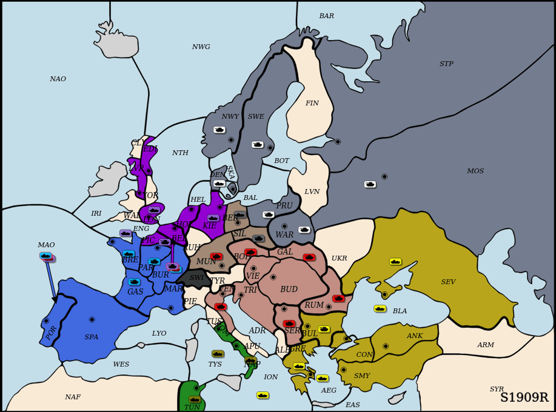

# DipLLM

> 🧠 A fine-tuned LLM agent for high-level strategic planning in **Diplomacy**, achieving strong performance against top agents like **Cicero**.  
> 📢 Accepted at **ICML 2025** — [**Paper**](https://arxiv.org/abs/2506.09655)

<div align="center">
  <strong>England (DipLLM)</strong> 🟣 vs  <strong>France (Cicero)</strong> 🔵
  
  

  <p><em>Figure: Gameplay demo — <strong>DipLLM</strong> (England) vs. <strong>Cicero</strong> (France)</em></p>
</div>

---
## 🛠️ Installation Instructions
This project is  built on the <a href="https://github.com/facebookresearch/diplomacy_cicero" target="_blank">
  <u>Cicero</u>
</a>
 framework. For installation and usage instructions, their repository provides comprehensive guidance.

### 🧩 Install Diplomacy Dependencies
```
# Clone the repo with submodules:
git clone --recursive git@github.com:facebookresearch/diplomacy_cicero.git diplomacy_cicero
cd diplomacy_cicero

# Apt installs
apt-get install -y wget bzip2 ca-certificates curl git build-essential clang-format-8 git wget cmake build-essential autoconf libtool pkg-config libgoogle-glog-dev

# Install conda
wget --quiet https://repo.anaconda.com/miniconda/Miniconda3-4.7.10-Linux-x86_64.sh -O ~/miniconda.sh
/bin/bash ~/miniconda.sh -b

# Create conda env
conda create --yes -n diplomacy_cicero python=3.7
conda activate diplomacy_cicero

# Install pytorch, pybind11
conda install --yes pytorch=1.7.1 torchvision cudatoolkit=11.0 -c pytorch
conda install --yes pybind11

# Install go for boringssl in grpc
# We have some hacky patching code for protobuf that is not guaranteed
# to work on versions other than this.
conda install --yes go protobuf=3.19.1

# Install python requirements
pip install -r requirements.txt

# Local pip installs
pip install -e ./thirdparty/github/fairinternal/postman/nest/
# NOTE: Postman here links against pytorch for tensors, for this to work you may
# need to separately have installed cuda 11 on your own.
pip install -e ./thirdparty/github/fairinternal/postman/postman/
pip install -e . -vv

# (Optional but recommended) Clean previous builds before compiling, especially if you encounter build errors
make clean

# Make
make

# Run unit tests
make test_fast
```
### 🧵Install DipLLM Fine-tuning Environment
```
conda create --name unsloth_env \
    python=3.10 \
    pytorch-cuda=12.1 \
    pytorch cudatoolkit xformers -c pytorch -c nvidia -c xformers \
    -y
conda activate unsloth_env

pip install "unsloth[colab-new] @ git+https://github.com/unslothai/unsloth.git"

pip install --no-deps "trl<0.9.0" peft accelerate bitsandbytes
```
## 💻Project Overview 
| Code Directory         | Description                                                           |
| ---------------------- | --------------------------------------------------------------------- |
| `fairdiplomacy/agents` | Includes DipLLM and various agents released or unreleased by Meta AI. |
| `conf`                 | Configuration files for different experiments and setups.             |
| `models`               | Pre-downloaded models used in training and evaluation.                |


## 🔧 Fine-tune DipLLM
### ▶️ Run Data Collection
```
python run.py --adhoc --cfg conf/c04_exploit/research_20240730_collect_data.prototxt launcher.local.use_local=true
```
### 🧹 Convert to JSON Format
Convert raw binary data to LLM-compatible text format:

```
python finetuning/data_process/bin2json.py --input_file_path --output_file_path
```

### 🎯 Fine-tune LLM
Use DeepSpeed to launch multi-GPU training:

```python
deepspeed --include localhost:0,1,2,3 finetune.py    
```
## 🤖 Test DipLLM
### 🛰️ Launch DipLLM API Server
```python
uvicorn make_api:app --host 0.0.0.0 --port 8011
```
### 🧪 Evaluate Against Cicero
```
python h2h_evaluate.py --adhoc --cfg conf/c01_ag_cmp/cmp_8011_cicero_nopress.prototxt
```

### 🤼‍♂️ Evaluate Against DipNet
```
python h2h_evaluate.py --adhoc --cfg conf/c01_ag_cmp/cmp_8011_base_strategy_model.prototxt
```

## 📝 Citation
If you find our research helpful and would like to reference it in your work, please consider the following citations:

```
@article{xu2025dipllm,
  title={DipLLM: Fine-Tuning LLM for Strategic Decision-making in Diplomacy}, 
  author={Kaixuan Xu, Jiajun Chai, Sicheng Li, Yuqian Fu, Yuanheng Zhu, Dongbin Zhao},
  booktitle={The Forty-Second International Conference on Machine Learning},
  year={2025},
  url={https://openreview.net/pdf?id=hfPaOxDWfI}
}
```
